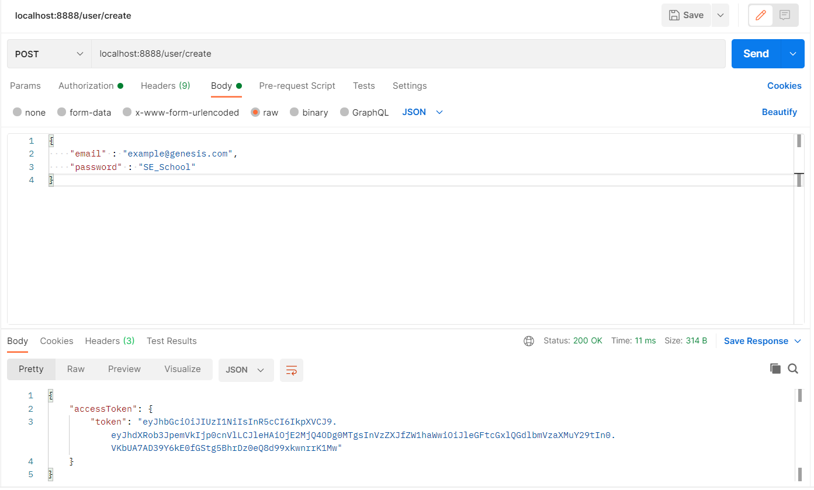
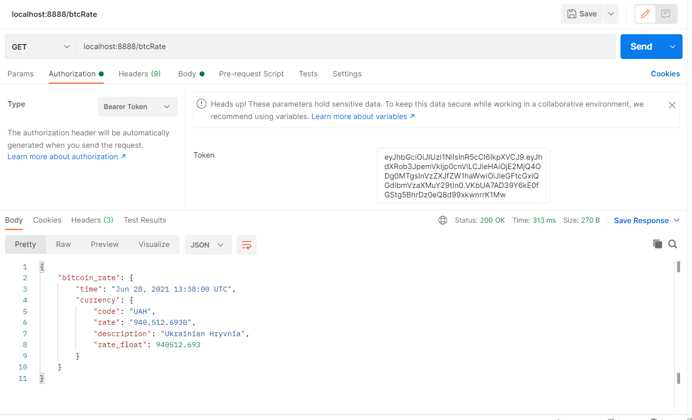

# Homework Update: Microservices

У новій гілці  **microservices** було переписано проект з урахуваннням мікросервісної архітектури. Було виділено два мікросервіси: сервіс користувачів та сервіс ціни біткоїна. Проте клієнт безпосередньо працює з api-gateway, у якому відбувається автентифікація і подальше переправлення запитів.

 Всі запити йдуть через http://localhost:6666 : 
 * http://localhost:6666/btcRate [GET] Requires jwt.
 * http://localhost:6666/user/create [POST]
 * http://localhost:6666/user/login [POST]

 Для зупуску у папці проекту в терміналі прописати ```docker-compose up --build```

# Homework Update: UML Diagram

Було додано 2 файли до папки *docs*:  **HW-4.drawio** та **HW-4.png** з діаграмою класів для застосунку "обмін валют". Telegram: @PickDough.

# Homework Update: Testing

Було додано 3 юніт тести для user.service.go, 2 інтреграційні тести для файлового репозиторію та 1 інтеграційний тест для coindesk.provider.go. Всі тести знаходяться у папка відповідних пакетів. Також у папці tests/unit знаходиться фейк репозиторію. 

# BTC_API

В проекті реалізовано всі вимоги до практичного завдання:
* 3 endpoints(*/user/create, /user/login, /btcRate*);
* автентифікація користувача за допомогою логіна та паролю
*  доступ до */btcRate* лише для ідентифікованих користувачів за допомогою JWT Access Token
* робота з користувацькими даними реалізована через файлову систему - дані про зареєстрованих користувачів зберігаються у файлі *users.data*

## Структура проекту
**main.go**

Точкою входу виступає файл *main.go*, у якому відбувається налаштування доступних шляхів для запитів, а також задається middleware для перевірки токенів, що приходять разом з запитом. Номер порту зчитується з файлу .env у якому знаходяться такі змінні оточення, як, наприклад,  номер порту та секрет для підпису токенів. *Примітка: users.data та .env не додані в git igonore спеціально для демонстрації структури.*

**models**

У цьому пакеті визначені типи, які використовуються для передачі даних: User, Token, BitcoinRate та Currency.

**middleware**

У цьому пакеті реалізована логіка проміжної логіки обробки запису, а саме перевірка аутентифікації. Якщо запит надісланий на закритий endpoint, то відбувається валідація JWT токена доступу. Якщо по якийсь причині валідація не закінчилися успішно, то користувач отримає помилку та її деталі.

**controllers**

У пакеті controllers реалізовані функції, що опрацьовують запити, що надходять до API. Також у цьому пакеті використовуються інтерфейси сервісів для зручності у тестуванні та заміні реалізації(*більш детально про переваги інтерфейсів зазначено в описі сервісів*) *Login* - отримує персональні дані користувача та перевіряє їх за допомогою функцій, що написані у пакеті сервісів. У разі неправильно вказаних даних повертається помилка та її опис. При успішній ідентифікації повертається згенерований access token. *Register* - отримує дані користувача та намагається його зареєструвати. У разі неправильно вказаних даних або ж уже зайнятого email повертається помилка та її опис. При успішній ідентифікації повертається згенерований access token. Rate - повертає ціну біткоіна в гривнях та час на момент якого вона є актуальною. Дані про ціну беруться за цим посиланням https://api.coindesk.com/v1/bpi/currentprice/UAH.json. GenerateToken - підписує новий access token.

**services**

У цьому пакеті реалізовано бізнес логіку, а також роботу з шаром доступу до даних, який представлений інтерфейсом **UserRepository**. Оскільки за даної реалізації робота з даними  відбувається через файлову систему, то в майбутньому можна буде легко змінити проекти додавши роботу через базу даних, при цьому не переписуючи жодних інших шарів окрім Data Access Layer.
Що до бізнес правил, то під час реєстрації користувача його email перевіряється регулярним виразом, і чи немає вже користувача з таким email. Під час логіну перевіряється лише відповідність даних, що надійшли тим, що знаходяться в репозиторії.

**dal**

Тип *FileRepository* імплементує інтерфейс *UserRepository*, тому підставляється на його місце в main.go. Робота з файловою системою реалізована стандартними потоками мови go з використанням lazy loading та кешуванням даних у зрізі.
`type FileRepository struct {  
mu    sync.Mutex;  
users []models.User;  
}`
Окрім цього доступ до файлу синхронізується за допомогою мютексу, тому кілька запитів не можуть переписати дані чи пошкодити їх якось по іншому.

**utils**

У пакеті utils реалізовані дві допоміжні функції для формування HTTP Response. Message - для створення словника з повідомленням та Response для запису даних у тіло відповіді. 

**Скріншоти роботи**




